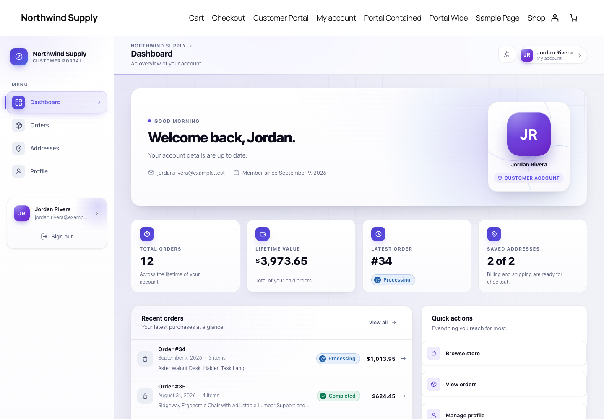
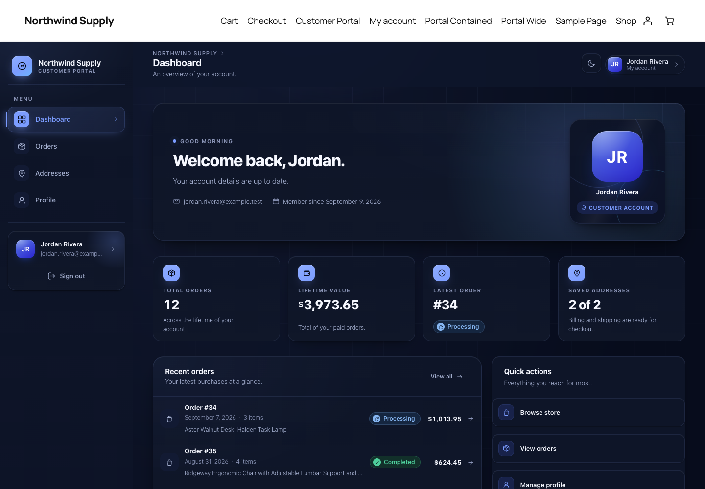
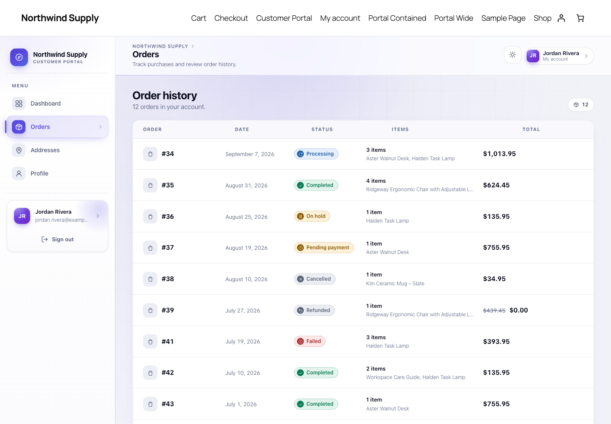
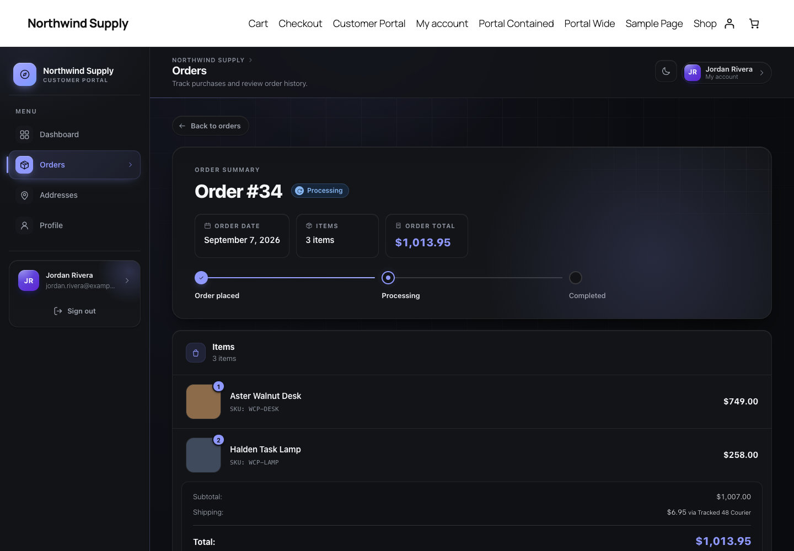
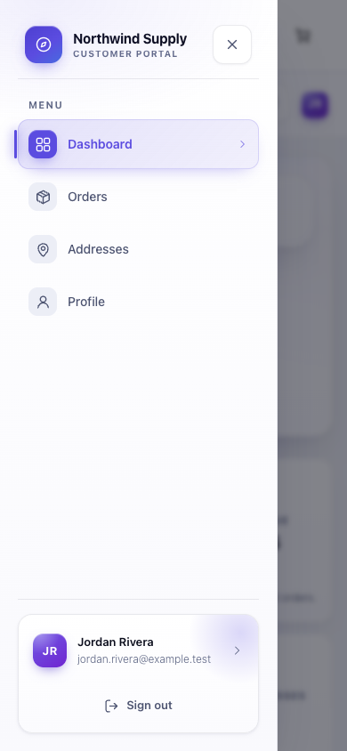
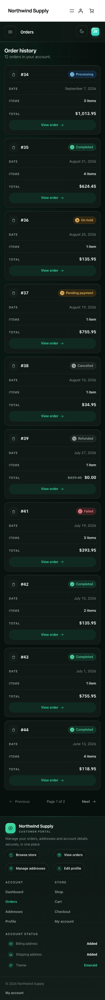
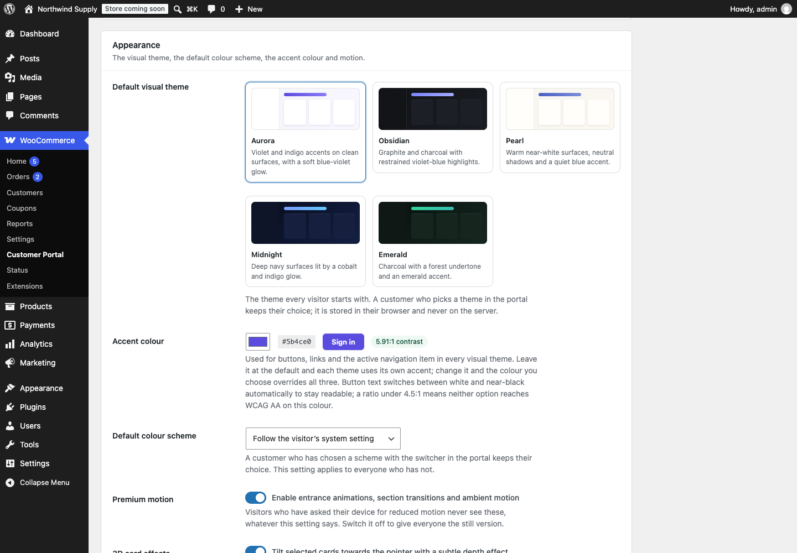

# WooCommerce Customer Portal

[](https://github.com/dhananjaysingh/woocommerce-customer-portal/actions/workflows/ci.yml)


A premium, self-contained customer portal for WooCommerce. Drop
`[wcp_customer_portal]` on any page and customers get an app-like account
area — dashboard, orders, addresses and profile — in place of the default
My Account tabs.

Built as a production-grade WordPress plugin: real WooCommerce data only,
structural cross-customer isolation, progressive enhancement, WCAG AA in both
themes, a 198-test suite against real WordPress + WooCommerce, and a
deterministic release build.

<p align="center">
  
  
</p>
<p align="center">
  
  
</p>
<p align="center">
  
  
  
</p>

## Features

**For customers**

- **Dashboard** — a composed screen rather than a row of widgets: status cards
  (orders, lifetime spend, latest order, saved addresses, profile state, member
  since), recent orders, account health, quick actions, the store's newest
  products and an activity feed. Every number is read from WooCommerce or
  WordPress for the signed-in customer; nothing is estimated and there are no
  invented "+12% this month" deltas. A customer with no orders gets the same
  composition with a **Getting started** checklist — five real conditions, a
  percentage that is simply completed over offered, and each outstanding row
  linking to the screen that finishes it.
- **Orders** — paginated history that becomes cards on a phone, and a full
  order detail view: timeline, line items, totals, addresses, payment, shipping
  and downloads. Custom order statuses from other plugins are labelled and
  coloured automatically.
- **Profile** — name, display name and email through WordPress's own
  validation; password change with current-password verification.
- **Addresses** — billing and shipping editors whose fields, labels, order and
  required flags come from WooCommerce's country definitions, with country →
  state switching and server-side postcode/phone/email validation.
- **Five visual themes** — Aurora, Obsidian, Pearl, Midnight and Emerald, each
  with a complete light and dark palette, all built from CSS custom properties
  in a single stylesheet. The appearance switcher offers the colour scheme and
  the theme side by side; system preference is the default, an explicit choice
  persists, and a pre-paint resolver means the wrong theme never flashes.
- **Tasteful depth** — cards tilt up to 5° toward a fine pointer with layered
  `translateZ`, and a soft spotlight tracks the pointer across premium
  surfaces. No 3D library; transform and opacity only. Disabled on touch,
  below 1025px, while typing in a card, under `prefers-reduced-motion`, and
  whenever the store switches the effects off.
- **A finished page, top to bottom** — every section closes with the portal's
  own footer: brand, quick actions, account and store links, and real account
  status. Short screens no longer trail off into empty canvas, because the
  content column takes the slack and the footer settles beneath it. On a
  full-width portal page it *is* the end of the page: the theme's own footer is
  suppressed there and nowhere else, so there is no second ending underneath.
- **App-like navigation** over server-rendered pages: `fetch` + History API
  with real deep links, working Back/Forward and focus management — and a full
  page load as the fallback. Every form also works with JavaScript disabled.

**For store owners**

- **Settings** under WooCommerce → Customer Portal: portal page, enabled
  sections, landing section, accent colour, default visual theme, default
  appearance, premium motion and 3D effect switches, live preview. A disabled
  section is enforced at the URL, REST and form-handler layers, not merely
  hidden.
- **Safe lifecycle** — deactivation keeps settings; uninstall removes only the
  plugin's own option and transients and never touches WooCommerce data.
- **HPOS compatible**, translation-ready, no external requests of any kind.

**For developers**

- Theme-overridable templates (`your-theme/woocommerce-customer-portal/`).
- Fifteen filters and actions covering navigation, layout, access control,
  order queries, status tones, profile fields, rate limits, CSP nonces and
  asset loading — see [`docs/API.md`](docs/API.md).
- A REST API under `wcp/v1` that shares its models, and therefore its
  ownership checks, with the templates.
- Design tokens as CSS custom properties; no build step anywhere.

## Requirements

| | Minimum | Tested up to |
| --- | --- | --- |
| PHP | 7.4 | 8.3 |
| WordPress | 6.0 | 7.1 |
| WooCommerce | 7.0 | 11.1 |

## Installation

**From a release ZIP** — Plugins → Add New → Upload Plugin, choose
`woocommerce-customer-portal.zip`, activate.

**From source** — copy this directory into `wp-content/plugins/` and activate
**WooCommerce Customer Portal**. Nothing needs compiling.

Then create a page containing:

```
[wcp_customer_portal]
```

The portal spans the viewport on its own. Add `layout="contained"` to keep it
inside the theme's content column.

## Security model

The controls below are structural — enforced by the shape of the code rather
than by checks someone has to remember. Full detail in
[`docs/SECURITY.md`](docs/SECURITY.md).

- **Identity comes from the session, never the request.** The customer is
  `get_current_user_id()`. No method in the orders, profile or address layer
  accepts a user or customer ID, so there is no parameter to attack.
- **One reader, two consumers.** Templates and REST routes share `WCP_Orders`,
  `WCP_Profile` and `WCP_Addresses`, so an ownership check cannot exist in one
  path and be missing from the other.
- **Not yours looks like not there.** A foreign order, a non-existent order and
  a malformed ID produce byte-identical `404` responses — no existence oracle.
- **Writes** require authentication, the WordPress REST nonce *and* a portal
  nonce, an allowlisted field set, server-side validation and sanitisation.
  Settings writes additionally require `manage_woocommerce`.
- **Rate limiting** per customer on profile, address and password writes, with
  `429` + `Retry-After`; password attempts count failures only, so a legitimate
  customer is never throttled and a guesser runs out fast.
- **Escape at output, everywhere.** Customer-controlled strings are stored raw
  and escaped in the template; the REST API returns raw values for the client
  to escape. Verified with planted payloads in every customer-writable field.
- **Accent colours** pass `sanitize_hex_color()` and are emitted as CSS custom
  properties only — no arbitrary CSS can reach the page. The visual theme is an
  allowlisted slug, re-validated before it is interpolated into the pre-paint
  script and re-checked in the browser against the same list.
- **Store discovery** lists only published, catalog-visible products, so the
  portal cannot surface something the store has deliberately hidden.

## Architecture

```
woocommerce-customer-portal.php   Bootstrap: constants, lifecycle, environment guards
uninstall.php                     Removes plugin data only; never WooCommerce data
├── includes/
│   ├── class-wcp-loader.php      Orchestrator + hook registry — the whole hook surface
│   ├── class-wcp-activator.php   Activation guards and install bookkeeping
│   ├── class-wcp-deactivator.php Reversible cleanup (keeps settings)
│   ├── class-wcp-auth.php        Session-backed identity. The only source of "who"
│   ├── class-wcp-security.php    Sanitisation, nonces, capabilities, ownership
│   ├── class-wcp-settings.php    One option, one sanitiser, run on read and write
│   ├── class-wcp-rate-limit.php  Per-user buckets on mutating requests
│   ├── class-wcp-helper.php      Templates, assets, icons, formatting
│   └── wcp-template-functions.php  Template-facing wrappers
├── admin/
│   ├── class-wcp-admin.php       Plugin-list surface, notices
│   ├── class-wcp-settings-page.php  WooCommerce → Customer Portal
│   └── views/settings-page.php   The screen (never theme-overridable)
├── public/
│   ├── class-wcp-public.php      Conditional asset loading, accent styles
│   ├── class-wcp-shortcodes.php  Shortcode registration and template context
│   ├── class-wcp-account.php     Read-only account view (private constructor)
│   ├── class-wcp-navigation.php  Section registry and routing
│   ├── class-wcp-page-layout.php Page framing: title suppression, full-width
│   ├── class-wcp-orders.php      Order repository + DTOs. The ownership gate
│   ├── class-wcp-order-status.php Status labels, tones and timeline
│   ├── class-wcp-dashboard.php   Real metrics, setup state, discovery, activity
│   ├── class-wcp-theme.php       Appearance + visual theme, pre-paint resolver
│   ├── class-wcp-profile.php     Profile fields: allowlist, validate, persist
│   ├── class-wcp-addresses.php   Addresses, driven by WooCommerce field defs
│   └── class-wcp-form-handler.php No-JavaScript form posts (PRG + flash)
├── rest/
│   ├── class-wcp-rest-orders.php  GET /orders, /orders/{id}
│   └── class-wcp-rest-account.php GET+POST /profile, /addresses/{type}
├── templates/                    Theme-overridable markup
├── assets/                       One stylesheet, one script, no build step
├── languages/                    POT file
├── tests/                        PHPUnit: unit, integration, security, degraded
├── scripts/build-plugin.sh       Deterministic release ZIP
└── docs/                         API, security, design system, phase plan
```

**Design decisions worth knowing**

- *One hook registry.* Components never call `add_action()` themselves. Every
  hook the plugin registers is listed in `WCP_Loader`, so the full surface is
  readable in one file.
- *CRUD only, never SQL.* Orders are read through `wc_get_orders()` and
  `wc_get_order()`, which route through the active data store. That is what
  makes the plugin correct under HPOS and the legacy post tables alike.
- *Sanitise on read and on write.* Settings are validated when saved **and**
  when loaded, so a value written around the Settings API is still harmless.
- *Real data or nothing.* WooCommerce keeps no status history, so the activity
  feed is built from the three timestamps it does record (placed, paid,
  completed) rather than a fabricated timeline.
- *Container queries for content, media queries for chrome.* A portal in a
  650px theme column is not a mobile layout even on a 1440px screen.
- *Speak the theme's language.* Full width uses core's own `alignfull` on
  block themes and a measured fallback on classic ones — no `!important`, no
  unscoped selectors.
- *No external requests.* No webfonts, no CDN, no Gravatar, no analytics.

## Development

Everything runs through Composer; no Node toolchain is needed.

```sh
composer install

composer lint              # php -l on every file
composer phpcs             # WordPress-Extra + WordPress-Docs + PHPCompatibilityWP
composer phpstan           # level 5 with WordPress + WooCommerce stubs
composer test              # PHPUnit: unit + integration + security
composer test:security     # the cross-customer / write-protection gate alone
composer test:degraded     # boot with WooCommerce absent
composer build             # dist/woocommerce-customer-portal.zip
composer qa                # all of the above
```

The test suite runs on the real WordPress test framework against a real
WooCommerce install. Point it at a core checkout and a throwaway database with
`WP_CORE_DIR`, `WC_PLUGIN_DIR` and `WP_TESTS_DB_*`; see
[`tests/README.md`](tests/README.md).

### Quality gates

| Gate | Status |
| --- | --- |
| PHPUnit | 222 tests, 848 assertions, all green on PHP 7.4 / 8.1 / 8.2 / 8.3 |
| Compatibility matrix | WP 6.0 + WC 7.0 · WP 6.4 + WC 8.5 · WP 7.1 + WC 11.1 |
| PHPCS | 0 violations (`WordPress-Extra`, `WordPress-Docs`, PHPCompatibility 7.4+) |
| PHPStan | Level 5, 0 errors |
| Security suite | Cross-customer and write-protection tests are a required CI check |
| Browser verification | 1440 / 1280 / 1024 / 768 / 390px, five themes, light and dark, WCAG AA measured |
| Packaging | Allowlisted, deterministic ZIP; clean install from ZIP verified on a fresh site |

## Customising

Override design tokens without editing the stylesheet:

```css
.wcp-portal {
    --wcp-primary: #0f766e;
    --wcp-primary-rgb: 15, 118, 110;
    --wcp-sticky-offset: 64px;   /* Clear a theme's fixed header. */
}
```

Override any template by copying it into
`your-theme/woocommerce-customer-portal/`. Extend the navigation with the
`wcp_navigation_items` filter. Full reference in [`docs/API.md`](docs/API.md).

## Documentation

| Document | Contents |
| --- | --- |
| [`docs/API.md`](docs/API.md) | Shortcode, filters, actions, templates, PHP surface, REST API |
| [`docs/SECURITY.md`](docs/SECURITY.md) | Threat model, controls, endpoint matrix, CSP guidance |
| [`docs/DESIGN_SYSTEM.md`](docs/DESIGN_SYSTEM.md) | Tokens, components, breakpoints, motion |
| [`docs/PHASE_PLAN.md`](docs/PHASE_PLAN.md) | How the plugin was built, phase by phase |
| [`CHANGELOG.md`](CHANGELOG.md) | Release history |

## License

GPL-2.0-or-later. See [`license.txt`](license.txt).
